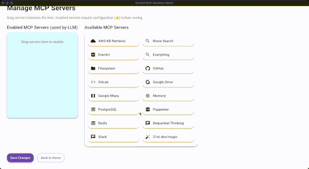

# Gemini MCP Desktop Client

<p align="left">
  <a href="https://www.electronjs.org/"></a>
  <a href="https://vitejs.dev/"></a>
  <a href="https://react.dev/"></a>
  <a href="https://www.typescriptlang.org/"></a>
  <a href="https://mui.com/"></a>
  <a href="https://emotion.sh/docs/introduction"></a>
  <a href="https://www.framer.com/motion/"></a>
</p>

**Gemini MCP Desktop Client** is a desktop client built with Electron, Vite, React, and TypeScript, designed to interact with various [Model Context Protocol (MCP) servers](https://github.com/modelcontextprotocol/servers).  
It also integrates Google's Gemini API to provide a powerful LLM chat experience.

## 🖼️ App Screenshot

<p align="center">
  
</p>  
</br>
<p align="center">
  
</p>  
</br>


---

## Features

- ⚡ **Fast and Modern Stack**: Built with Electron, React, Vite, and TypeScript.
- 🔌 **MCP Server Integration**: Connects to multiple MCP servers for diverse data operations.
- 🤖 **LLM Chat Support**: Uses [Gemini API](https://ai.google.dev/gemini-api/docs) for LLM-based chatting.
- 🖥️ **Cross-Platform**: Packages for Windows (NSIS installer) and macOS (DMG).
- 🎨 **Beautiful UI**: Built with MUI, Emotion, Framer Motion, and other modern libraries.
- 📚 **Markdown Rendering**: Supports rich markdown with syntax highlighting.
- 🛠️ **Developer Friendly**: Full TypeScript support, ESLint, and Vite HMR.

---

## Installation

```bash
git clone https://github.com/duke7able/gemini-mcp-desktop-client.git
cd gemini-mcp-desktop-client
npm install
```

---

### Environment Setup

Create a `.env` file in the root directory of the project with the following content:

```bash
PORT=5001 # Port for the backend API server
VITE_API_URL=http://localhost:5001
NODE_ENV="DEVELOPMENT"
```

> Make sure to adjust `VITE_API_URL` if you run your backend server on a different port or domain.

---

## Development

To start the app in development mode:

```bash
npm run dev
```

This will start Vite and Electron in watch mode for live-reloading.

---

## Build

To create a production build:

```bash
npm run build
```

This will:

- Compile the TypeScript code
- Build the Vite frontend
- Package the Electron app using `electron-builder`

Output will be available inside the `dist/` and `dist-electron/` folders.

---

## Scripts

| Script | Description |
| :----- | :---------- |
| `npm run dev` | Start the app in development mode (Vite + Electron) |
| `npm run build` | Build the app for production |
| `npm run preview` | Preview the production Vite build |
| `npm run lint` | Run ESLint on the codebase |

---

## Tech Stack

- **Electron** - Desktop application framework
- **Vite** - Frontend tooling and development server
- **React** - UI library
- **TypeScript** - Static typing
- **@modelcontextprotocol/sdk** - MCP Server interaction
- **@google/generative-ai** - Gemini LLM API integration
- **MUI** - Material UI components
- **Emotion** - CSS-in-JS styling
- **Framer Motion** - Animations
- **Express** - Local API server within the app
- **Zod** - Runtime validation
- **React Router** - Routing inside the app

---
You can update your `README.md` by adding a link to the `mcpServerTested.md` file and a short explanation. Here’s how you can insert it in the **"MCP Servers"** section of your `README.md`:

---

### 📌 MCP Servers

This client is designed to interact with various MCP servers listed at:  
👉 [Model Context Protocol - Servers](https://github.com/modelcontextprotocol/servers)

> There are many MCP servers available, including third-party MCP implementations integrated into this application.  
> However, I have created a separate list of **tested and verified MCP servers** to help users identify reliable options.

👉 **See the list of tested MCP servers here:** [mcpServerTested.md](./mcpServerTested.md)

You can configure which server to connect to from within the app settings.

---

Let me know if you'd like this inserted automatically into your file or formatted differently.

## Gemini API

This app uses [Gemini](https://ai.google.dev/gemini-api/docs) to provide LLM-based chat inside the app.

Make sure you have your API key to configure app

---

## Packaging Targets

- **macOS**: DMG installer
- **Windows**: NSIS installer (x64 architecture)

---

## Folder Structure

```
/
├── dist/               # Vite frontend build output
├── dist-electron/      # Electron main process build output
├── static/             # Static assets
├── src/                # Source code (React + Electron)
├── package.json
├── vite.config.ts
└── electron-builder.yml
```

## 🧰 Enable/Disable DevTools

You can control whether **DevTools** are enabled in the Electron window directly from the `electron/main.ts` file.

In the `createWindow` function, modify the `devTools` property inside the `webPreferences` object to control this behavior:

```ts
devTools: false // Set to true to enable DevTools, false to disable
```

Additionally, you can programmatically open DevTools using:

```ts
win.webContents.openDevTools(); // Opens DevTools automatically when the app launches
```

### Example:

```ts
function createWindow() {
  const { width, height } = screen.getPrimaryDisplay().workAreaSize;
  win = new BrowserWindow({
    width,
    height,
    icon: path.join(process.env.VITE_PUBLIC, "electron-vite.svg"),
    webPreferences: {
      webSecurity: false,
      preload: path.join(__dirname, "preload.mjs"),
      contextIsolation: true,
      nodeIntegration: true,
      devTools: false, // ✅ Change this to true or false as needed
    },
  });

  if (VITE_DEV_SERVER_URL) {
    win.loadURL(VITE_DEV_SERVER_URL);
  } else {
    win.loadFile(path.join(RENDERER_DIST, "index.html"));
  }

  // ✅ Open DevTools automatically (only works if devTools is true)
  win.webContents.openDevTools();
}
```

> ⚠️ Ensure `devTools` is set to `true` in `webPreferences` if you want `openDevTools()` to work. Otherwise, the DevTools will not open.


## Notes

- Make sure to have Node.js and npm installed.
- The app is under active development — contributions and feedback are welcome!

